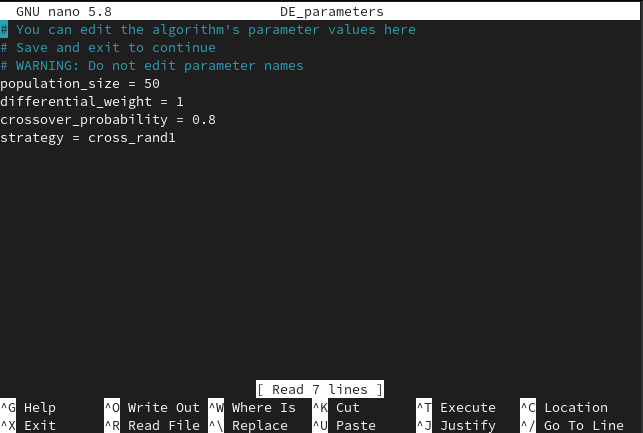

Command Line Interface
======================

We provide a simple command line interface, which allows you to easily
mine association rules on any input dataset, output them to a csv file and/or perform
a simple statistical analysis on them.

Usage
-----

.. code-block:: shell

    niaarm -h  # or python -m niaarm -h

.. code-block:: text

    usage: niaarm [-h] [-v] -i INPUT_FILE [-o OUTPUT_FILE] -a ALGORITHM [-s SEED]
                  [--max-evals MAX_EVALS] [--max-iters MAX_ITERS] --metrics
                  METRICS [METRICS ...] [--weights WEIGHTS [WEIGHTS ...]] [--log]
                  [--show-stats]

    Perform ARM, output mined rules as csv, get mined rules' statistics

    options:
      -h, --help            show this help message and exit
      -v, --version         show program's version number and exit
      -i INPUT_FILE, --input-file INPUT_FILE
                            Input file containing a csv dataset
      -o OUTPUT_FILE, --output-file OUTPUT_FILE
                            Output file for mined rules
      -a ALGORITHM, --algorithm ALGORITHM
                            Algorithm to use (niapy class name, e.g.
                            DifferentialEvolution)
      -s SEED, --seed SEED  Seed for the algorithm's random number generator
      --max-evals MAX_EVALS
                            Maximum number of fitness function evaluations
      --max-iters MAX_ITERS
                            Maximum number of iterations
      --metrics METRICS [METRICS ...]
                            Metrics to use in the fitness function.
      --weights WEIGHTS [WEIGHTS ...]
                            Weights in range [0, 1] corresponding to --metrics
      --log                 Enable logging of fitness improvements
      --stats               Display stats about mined rules

Output rules to csv
~~~~~~~~~~~~~~~~~~~

Mine Association rules on the Abalone dataset (`available here <https://archive.ics.uci.edu/ml/datasets/Abalone>`_)
and output them to a csv file. We'll run Differential evolution for 30 iterations, logging fitness improvements.
We selected the support and confidence metrics, their weights will defaulting to 1.

.. code-block:: shell

    niaarm -i Abalone.csv -a DifferentialEvolution --max-iters 30 --metrics support confidence -o output.csv --log

After running the above command we are prompted to edit the algorithms parameters in a text editor
(vi or nano on unix, notepad on windows):

After we're done editing the parameters, we save the file and exit the editor, so the algorithm can run.
The output should look like this:

.. code-block:: text

    Fitness: 0.006713839591358101, Support: 0.006703375628441465, Confidence: 0.0067243035542747355
    Fitness: 0.011814753063668868, Support: 0.005745750538664113, Confidence: 0.01788375558867362
    Fitness: 0.4774755380849042, Support: 0.027531721331098876, Confidence: 0.9274193548387096
    Fitness: 0.47886170567035946, Support: 0.24323677280344744, Confidence: 0.7144866385372715
    Fitness: 0.5001197031362221, Support: 0.00023940627244433804, Confidence: 1.0
    Fitness: 0.5002394062724443, Support: 0.00047881254488867607, Confidence: 1.0
    Fitness: 0.6182100887777294, Support: 0.2824994014843189, Confidence: 0.9539207760711399
    Fitness: 0.7280954808121962, Support: 0.7115154417045727, Confidence: 0.7446755199198196
    Fitness: 0.9669248968790327, Support: 0.9492458702418003, Confidence: 0.9846039235162652
    Fitness: 1.0, Support: 1.0, Confidence: 1.0

    Rules exported to output.csv

Let's make sure it generated a csv file with the rules:

.. code-block:: shell

    head -n 5 output.csv

.. code-block:: text

    antecedent,consequent,fitness,support,confidence,lift,coverage,rhs_support,conviction,amplitude,inclusion,interestingness,comprehensibility,netconf,yulesq
    "[Diameter([0.055, 0.65])]","[Rings([1, 29])]",1.0,1.0,1.0,1.0,1.0,1.0,0.0,0.0,0.2222222222222222,0.9997605937275557,0.6309297535714574,0.0,-1.0
    "[Length([0.075, 0.815])]","[Whole weight([0.002, 2.8255])]",1.0,1.0,1.0,1.0,1.0,1.0,0.0,0.0,0.2222222222222222,0.9997605937275557,0.6309297535714574,0.0,-1.0
    "[Shell weight([0.0015, 1.005])]","[Whole weight([0.002, 2.8255])]",1.0,1.0,1.0,1.0,1.0,1.0,0.0,0.0,0.2222222222222222,0.9997605937275557,0.6309297535714574,0.0,-1.0
    "[Length([0.075, 0.815])]","[Shucked weight([0.001, 1.488])]",1.0,1.0,1.0,1.0,1.0,1.0,0.0,0.0,0.2222222222222222,0.9997605937275557,0.6309297535714574,0.0,-1.0

Displaying statistics
~~~~~~~~~~~~~~~~~~~~~

With the ``--stats`` flag we can print basic statistics about the mined association rules.
E.g. (for the above run):

.. code-block:: text

    STATS:
    Total rules: 571
    Average fitness: 0.41468758207787
    Average support: 0.2218516293252978
    Average confidence: 0.6075235348304421
    Average lift: 4.594338596271166
    Average coverage: 0.42734229269031015
    Average consequent support: 0.5431864178239016
    Average conviction: 206259068653654.78
    Average amplitude: 0.42957104685221487
    Average inclusion: 0.39307258221443864
    Average interestingness: 0.23451084908249198
    Average comprehensibility: 0.6063087509647604
    Average netconf: 0.07274126434826349
    Average Yule's Q: 0.779065174397917
    Average length of antecedent: 1.97723292469352
    Average length of consequent: 1.5604203152364273
    Run Time: 6.4538s

