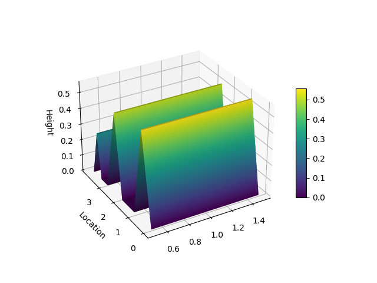

Getting Started
===============

This section is going to show you how to use the NiaARM framework.

Installation
------------

You can install NiaARM package using the following command:

.. code:: bash

    pip install niaarm

Usage
-----

Loading Data
~~~~~~~~~~~~

In NiaARM, data loading is done via the :class:`~niaarm.dataset.Dataset` class.
There are two options for loading data:

**Option 1: Directly from file**

.. code:: python

    from niaarm import Dataset

    dataset = Dataset('Abalone.csv')
    print(dataset)

**Option 2: From a pandas DataFrame (recommended)**

This option is recommended, as it allows you to preprocess the data before mining.

.. code:: python

    import pandas as pd
    from niaarm import Dataset

    df = pd.read_csv('Abalone.csv')
    # Preprocess the dataframe...
    dataset = Dataset(df)
    print(dataset)

**Output:**

.. code:: text

    DATASET INFO:
    Number of transactions: 4177
    Number of features: 9

    FEATURE INFO:

                        Sex Length Diameter Height Whole weight Shucked weight Viscera weight Shell weight Rings
    dtype       categorical  float    float  float        float          float          float        float   int
    min_val             N/A  0.075    0.055    0.0        0.002          0.001         0.0005       0.0015     1
    max_val             N/A  0.815     0.65   1.13       2.8255          1.488           0.76        1.005    29
    categories    [M, F, I]    N/A      N/A    N/A          N/A            N/A            N/A          N/A   N/A

Preprocessing
~~~~~~~~~~~~~

The :mod:`~niaarm.preprocessing` module provides functions for preprocessing transaction data.
The only preprocessing method currently implemented is the :func:`~niaarm.preprocessing.squash` method,
presented in `this paper <https://ieeexplore.ieee.org/document/10022240>`__.

.. code:: python

    from niaarm.dataset import Dataset
    from niaarm.preprocessing import squash

    dataset = Dataset('datasets/Abalone.csv')
    squashed = squash(dataset, threshold=0.9, similarity='euclidean')
    print(squashed)

**Output:**

.. code:: text

    DATASET INFO:
    Number of transactions: 626
    Number of features: 9

    FEATURE INFO:

                      Sex Length Diameter Height Whole weight Shucked weight Viscera weight Shell weight Rings
    dtype        category  float    float  float        float          float          float        float   int
    min_val           N/A  0.075    0.055    0.0        0.002          0.001         0.0005       0.0015     1
    max_val           N/A  0.815     0.65   1.13       2.8255          1.488           0.76        1.005    29
    categories  [F, I, M]    N/A      N/A    N/A          N/A            N/A            N/A          N/A   N/A

Mining Association Rules
~~~~~~~~~~~~~~~~~~~~~~~~

Once the data has been loaded, we can run our mining algorithm.

The key component here is our :class:`~niaarm.niaarm.NiaARM` class, which inherits from NiaPy's
Problem class. It implements numerical association rule mining as a real valued, single
objective, unconstrained maximization problem (more details on this approach can be found
`here <https://link.springer.com/chapter/10.1007/978-3-030-68154-8_19>`__ and
`here <http://www.iztok-jr-fister.eu/static/publications/231.pdf>`__).
To summarize, for each solution vector a :class:`~niaarm.rule.Rule` is built,
and it's fitness is computed as a weighted sum of selected interest measures (metrics).
The rule is then appended to a list of rules, which can be accessed through the NiaARM class.

The :class:`~niaarm.niaarm.NiaARM` class takes the dataset's
dimension (calculated dimension of the optimization problem), features, and transactions
(all attributes of the :class:`~niaarm.dataset.Dataset` class) and the metrics selected for
the fitness function. The metrics can either be passed in as a sequence of strings, in
which case the weights of the metrics will be set to 1, or you can pass in a dict containing
pairs of ``{'metric_name': weight}``. You can also enable logging of fitness improvements
by setting the ``logging`` parameter to ``True``.

Bellow is a simple example of mining association rules on the Abalone dataset that we
loaded above. For this example we picked Differential Evolution, specifically DE/rand/1/bin,
which we'll be running for 50 iterations.
All available algorithms can be found in the `NiaPy documentation <https://niapy.org/en/stable/>`__.
We've selected the metrics: 'support', 'confidence', 'inclusion' and 'amplitude' for the fitness
function. We then sort the rules by fitness in descending order and export them to csv.

.. code:: python

    from niaarm import NiaARM
    from niapy.task import OptimizationType, Task
    from niapy.algorithms.basic import DifferentialEvolution

    # DE/rand/1/bin
    algorithm = DifferentialEvolution(population_size=50,
                                      differential_weight=0.8,
                                      crossover_probability=0.9)

    metrics = ('support', 'confidence', 'inclusion', 'amplitude')

    problem = NiaARM(dataset.dimension, dataset.features, dataset.transactions, metrics, logging=True)
    task = Task(problem, max_iters=50, optimization_type=OptimizationType.MAXIMIZATION)

    algorithm.run(task)

    problem.rules.sort(by='fitness', reverse=True)
    problem.rules.to_csv('output.csv')

The mined rules are stored in ``problem.rules``, a :class:`~niaarm.rule_list.RuleList`. A
RuleList is a thin wrapper around a normal python list, with the added functionalities of
sorting by metric, exporting rules to csv, and properties for getting statistical data
about the rules. Printing a RuleList prints a statistical report of the rules in it.

**Output:**

.. code:: text

    Fitness: 0.4421065111459649, Support: 0.00023940627244433804, Confidence: 1.0, Inclusion: 0.3333333333333333, Amplitude: 0.43485330497808217
    Fitness: 0.5363319939110781, Support: 0.006942781900885803, Confidence: 0.9354838709677419, Inclusion: 0.5555555555555556, Amplitude: 0.6473457672201293
    Fitness: 0.5395969006117709, Support: 0.1812305482403639, Confidence: 0.9895424836601308, Inclusion: 0.4444444444444444, Amplitude: 0.5431701261021447
    Fitness: 0.5560783231641568, Support: 0.0023940627244433805, Confidence: 1.0, Inclusion: 0.6666666666666666, Amplitude: 0.5552525632655172
    Fitness: 0.5711107256845077, Support: 0.5997127124730668, Confidence: 1.0, Inclusion: 0.3333333333333333, Amplitude: 0.3513968569316307
    Fitness: 0.5970815767218225, Support: 0.8099114196791956, Confidence: 0.9955856386109476, Inclusion: 0.3333333333333333, Amplitude: 0.2494959152638132
    Fitness: 0.6479501714015481, Support: 0.7455111323916687, Confidence: 0.9860671310956302, Inclusion: 0.3333333333333333, Amplitude: 0.5268890887855602
    Fitness: 0.6497709183879634, Support: 0.9820445295666747, Confidence: 1.0, Inclusion: 0.4444444444444444, Amplitude: 0.17259469954073503
    Fitness: 0.6522418829904134, Support: 0.9176442422791478, Confidence: 0.9422320550639135, Inclusion: 0.4444444444444444, Amplitude: 0.304646790174148
    Fitness: 0.6600433108204055, Support: 0.9762987790280105, Confidence: 1.0, Inclusion: 0.5555555555555556, Amplitude: 0.1083189086980556
    Fitness: 0.6625114159138297, Support: 0.9209959300933684, Confidence: 1.0, Inclusion: 0.3333333333333333, Amplitude: 0.39571640022861654
    Fitness: 0.6748446186051374, Support: 0.9916207804644481, Confidence: 0.9916207804644481, Inclusion: 0.4444444444444444, Amplitude: 0.27169246904720923
    Fitness: 0.6868285539707781, Support: 0.949006463969356, Confidence: 0.9927372902579514, Inclusion: 0.5555555555555556, Amplitude: 0.25001490610024923
    Rules exported to output.csv

Mining Association Rules (Simplified)
~~~~~~~~~~~~~~~~~~~~~~~~~~~~~~~~~~~~~

In addition to the above interface, we provide a much simpler one in the form of a simple
function: :class:`~niaarm.mine.get_rules`. The function accepts a dataset object, an algorithm,
sequence or dict of metrics, a stopping condition (either ``max_evals`` or ``max_iters``) and
a ``logging`` flag. The algorithm can either be a NiaPy Algorithm instance, or a string,
in which case it's parameters can be passed in to the function as additional keyword arguments.

The :class:`~niaarm.mine.get_rules` function returns a named tuple of (rules, run_time),
where rules is a :class:`~niaarm.rule_list.RuleList` and run_time is the run time of
the algorithm in seconds.

The same example as above, using :class:`~niaarm.mine.get_rules`:

.. code:: python

    from niaarm import get_rules
    from niapy.algorithms.basic import DifferentialEvolution

    # DE/rand/1/bin
    algorithm = DifferentialEvolution(population_size=50,
                                      differential_weight=0.8,
                                      crossover_probability=0.9)

    metrics = ('support', 'confidence', 'inclusion', 'amplitude')
    rules, run_time = get_rules(dataset, algorithm, metrics, max_iters=50)
    print(rules)
    print(f'Run Time: {run_time:.4f} seconds')
    rules.to_csv('output.csv')

**Output:**

.. code:: text

    STATS:
    Total rules: 1153
    Average fitness: 0.47320577312454054
    Average support: 0.3983325861836626
    Average confidence: 0.7050696319555724
    Average lift: 1.8269022321777044
    Average coverage: 0.5791478590164908
    Average consequent support: 0.6708142990119975
    Average conviction: 80294763647830.92
    Average amplitude: 0.33832710930158877
    Average inclusion: 0.45109376505733834
    Average interestingness: 0.4107718184209992
    Average comprehensibility: 0.6225319999993354
    Average netconf: 0.08165217509315073
    Average Yule's Q: 0.2631267094311884
    Average length of antecedent: 2.248048568950564
    Average length of consequent: 1.8117953165654814
    Run Time: 6.9498 seconds
    Rules exported to output.csv

Visualization
~~~~~~~~~~~~~

The :mod:`~niaarm.visualize` module provides functions for plotting association rules.
The only visualization method currently implemented is the :func:`~niaarm.visualize.hill_slopes` method,
presented in `this paper <https://link.springer.com/chapter/10.1007/978-3-030-62362-3_10>`__.

.. code:: python

    from matplotlib import pyplot as plt
    from niaarm import Dataset, RuleList, get_rules
    from niaarm.visualize import hill_slopes

    dataset = Dataset('datasets/Abalone.csv')
    metrics = ('support', 'confidence')
    rules, _ = get_rules(dataset, 'DifferentialEvolution', metrics, max_evals=1000, seed=1234)
    some_rule = rules[150]
    hill_slopes(some_rule, dataset.transactions)
    plt.show()

**Output:**

Text Mining (Experimental)
~~~~~~~~~~~~~~~~~~~~~~~~~~

An experimental implementation of association rule text mining using nature-inspired algorithms
is also provided. The :mod:`niaarm.text` module contains the :class:`~niaarm.text.Corpus` and :class:`~niaarm.text.Document` classes for loading and preprocessing corpora,
a :class:`~niaarm.text.TextRule` class, representing a text rule, and the :class:`~niaarm.text.NiaARTM` class, implementing association rule text mining
as a continuous optimization problem. The :func:`~niaarm.mine.get_text_rules` function, equivalent to :func:`~niaarm.mine.get_rules`, but for text mining, was also
added to the :mod:`niaarm.mine` module.

.. code:: python

    import pandas as pd
    from niaarm.text import Corpus
    from niaarm.mine import get_text_rules
    from niapy.algorithms.basic import ParticleSwarmOptimization

    df = pd.read_json('datasets/text/artm_test_dataset.json', orient='records')
    documents = df['text'].tolist()
    corpus = Corpus.from_list(documents)

    algorithm = ParticleSwarmOptimization(population_size=200, seed=123)
    metrics = ('support', 'confidence', 'aws')
    rules, time = get_text_rules(corpus, max_terms=5, algorithm=algorithm, metrics=metrics, max_evals=10000, logging=True)

    if len(rules):
        print(rules)
        print(f'Run time: {time:.2f}s')
        rules.to_csv('output.csv')
    else:
        print('No rules generated')
        print(f'Run time: {time:.2f}s')

**Note:** You may need to download stopwords and the punkt_tab tokenizer from nltk by running `import nltk; nltk.download('stopwords'); nltk.download('punkt_tab')`.

**Output:**

.. code:: text

    Fitness: 0.53345778328699, Support: 0.1111111111111111, Confidence: 1.0, Aws: 0.48926223874985886
    Fitness: 0.7155830770302328, Support: 0.1111111111111111, Confidence: 1.0, Aws: 1.0356381199795872
    Fitness: 0.7279963436805833, Support: 0.1111111111111111, Confidence: 1.0, Aws: 1.072877919930639
    Fitness: 0.7875917299029188, Support: 0.1111111111111111, Confidence: 1.0, Aws: 1.251664078597645
    Fitness: 0.8071206688346807, Support: 0.1111111111111111, Confidence: 1.0, Aws: 1.310250895392931
    STATS:
    Total rules: 52
    Average fitness: 0.5179965084882088
    Average support: 0.11538461538461527
    Average confidence: 0.7115384615384616
    Average lift: 5.524038461538462
    Average coverage: 0.17948717948717943
    Average consequent support: 0.1517094017094015
    Average conviction: 1568561408678185.8
    Average amplitude: nan
    Average inclusion: 0.007735042735042727
    Average interestingness: 0.6170069642291859
    Average comprehensibility: 0.6763685578758655
    Average netconf: 0.6675824175824177
    Average Yule's Q: 0.9670329670329672
    Average antecedent length: 1.6346153846153846
    Average consequent length: 1.8461538461538463

    Run time: 13.37s
    Rules exported to output.csv

Interest Measures
-----------------

The framework currently implements the following interest measures (metrics):

- Support
- Confidence
- Lift [#fn]_
- Coverage
- RHS Support
- Conviction [#fn]_
- Inclusion
- Amplitude
- Interestingness
- Comprehensibility
- Netconf [#fn]_
- Yule's Q [#fn]_
- Zhang's Metric [#fn]_

More information about these interest measures can be found in the API reference
of the :class:`~niaarm.rule.Rule` class.

.. rubric:: Footnotes

.. [#fn] Not available as fitness metrics.

Examples
--------

You can find the full code and usage examples `here <https://github.com/firefly-cpp/NiaARM/tree/main/examples>`_.
