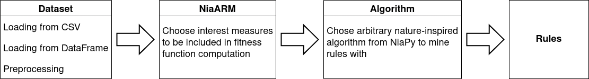

# Summary

Association Rule Mining (ARM) is a data mining method intended for discovering relations between attributes in
transaction databases in the form of implications [@agrawal_fast_1994; @fister_jr_brief_2020]. Traditional
approaches, such as the Apriori algorithm [@agrawal_fast_1994] or ECLAT [@zaki_scalable_2000],
require the attributes in the database to be discretized. This can result in the incorporation of noise into data,
and potentially obtained associations may not fully reveal the story [@varol2020performance]. On the contrary,
Numerical association rule mining (NARM) is an extension of ARM that allows handling numerical attributes without
discretization [@fister_jr_improved_2021]. Thus, an algorithm can operate directly, not only with
categorical but also with numerical attributes concurrently. Interestingly, most NARM algorithms are based on
stochastic population-based nature-inspired algorithms, which proved to be very efficient in searching for association rules.

The NiaARM framework is an implementation of the ARM-DE algorithm [@fister_differential_2018; @fister_jr_improved_2021], where
numeric association rule mining is modeled as a single objective, continuous optimization problem, where the fitness is a
weighted sum of the support and confidence of the built rule. The approach is extended by allowing the use of any optimization
algorithm from the related NiaPy framework [@vrbancic_niapy_2018], as well as having the option to select various interest
measures and their corresponding weights for the fitness function.

The flow of the NiaARM framework is shown in \autoref{fig:NiaARM}. Users have the option to construct a dataset either from a
CSV file or a pandas DataFrame. The dataset is then used to build the optimization problem, along with user selected interest
measures to be used in the computation of the fitness function. Then the optimization problem can be solved using any algorithm
in the NiaPy library to mine association rules from the dataset. The rules can be exported to a CSV file, statistically
analysed or visualized using the visualization methods implemented in the framework, such as the hill slopes method
[@fister_visualization_2020]. A simple command line interface for mining rules is also provided.

# Statement of need

Numerical association rule mining plays a vital role in the data revolution era [@telikani_survey_2020]. Several research
papers that present NARM methods exist, but universal software where all primary tasks of NARM, i.e., preprocessing, searching
for association rules, and visualization, are lacking. The NiaARM framework provides users with methods that allow them to
preprocess their data, implement several interest measures, and powerful visualization techniques. In a nutshell, the benefits
of the NiaARM framework are:

1. Simple way to mine association rules on numerical and categorical datasets.

2. Combined with the NiaPy library, it allows testing out the ARM-DE approach using arbitrary nature-inspired algorithms.

3. Implementation of several popular interest measures, for measuring the quality of mined rules.

4. Powerful visualization methods.

5. A simple command line interface for mining association rules.

# References
