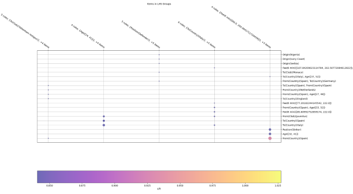
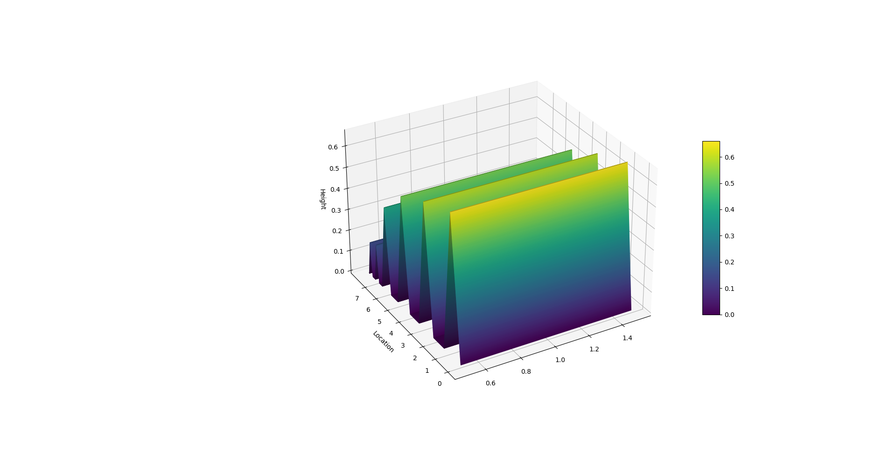
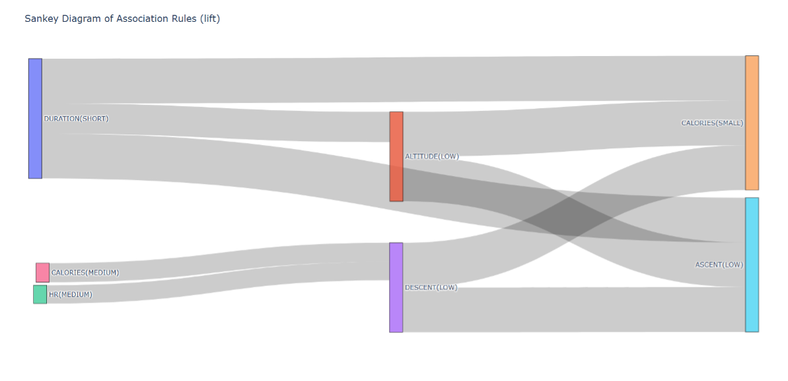
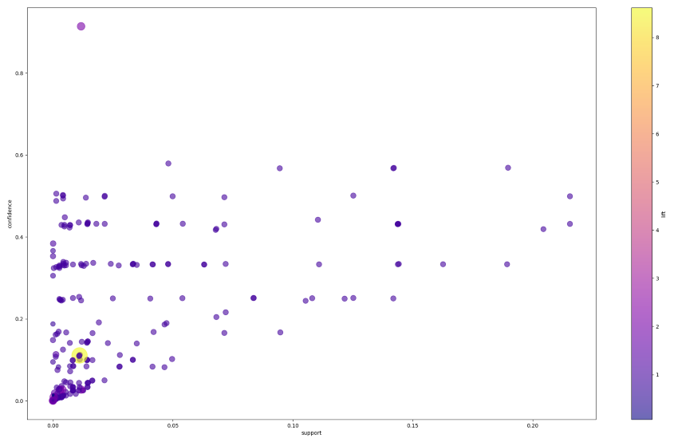
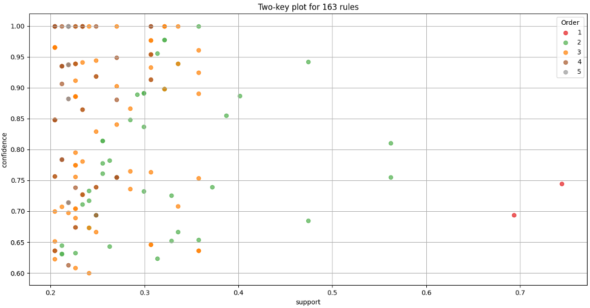

# Visualizations

## Grouped matrix plot

A grouped matrix plot visualizes the relationships between different groups of data. It is useful for identifying patterns and correlations within the dataset.

**Reference**: Hahsler M. in Karpienko R. (2017). Visualizing association rules in hierarchical
groups, Journal of Business Economics, 87, 3, str. 317–335,
[https://doi.org/10.1007/s11573-016-0822-8](https://link.springer.com/article/10.1007/s11573-016-0822-8).

## Hill slopes

Hill slopes plots are used to visualize the steepness and direction of slopes in a dataset. They are often used in geographical and environmental data analysis.

**Reference**: Fister Ml. I., Fister D., Iglesias A., Galvez A., Osaba E., Del Ser J. in Fister I. (2020).
Visualization of Numerical Association Rules by Hill Slopes. V: Analide, C.,
Novais, P., Camacho, D., Yin, H. (ur.), Intelligent Data Engineering and
Automated Learning – IDEAL 2020. IDEAL 2020. Lecture Notes in Computer
Science(), vol 12489. Springer, Cham., str. 101-111,
[https://doi.org/10.1007/978-3-030-62362-3_10](https://link.springer.com/chapter/10.1007/978-3-030-62362-3_10).

## Sankey diagram

A Sankey diagram is a flow diagram that shows the flow of data between different nodes. It is useful for visualizing the distribution and movement of data.

**Reference**: Fister Ml. I., Fister I., Fister D., Podgorelec V. in Salcedo-Sanz S. (2023). A
comprehensive review of visualization methods for association rule mining:
Taxonomy, challenges, open problems and future ideas. Expert Systems
Applications, 233, str. 120901, [https://doi.org/10.1016/j.eswa.2023.120901](https://www.sciencedirect.com/science/article/abs/pii/S0957417423014033).

## Scatter plot

A scatter plot displays values for typically two variables for a set of data. It is useful for identifying relationships and correlations between the variables.

**Reference**: Fister Ml. I., Fister I., Fister D., Podgorelec V. in Salcedo-Sanz S. (2023). A
comprehensive review of visualization methods for association rule mining:
Taxonomy, challenges, open problems and future ideas. Expert Systems
Applications, 233, str. 120901, [https://doi.org/10.1016/j.eswa.2023.120901](https://www.sciencedirect.com/science/article/abs/pii/S0957417423014033).

## Two-key plot

A two-key plot visualizes the relationship between two key metrics in a dataset. It is useful for comparing and contrasting the metrics to identify trends and patterns.

**Reference**: Fister Ml. I., Fister I., Fister D., Podgorelec V. in Salcedo-Sanz S. (2023). A
comprehensive review of visualization methods for association rule mining:
Taxonomy, challenges, open problems and future ideas. Expert Systems
Applications, 233, str. 120901, [https://doi.org/10.1016/j.eswa.2023.120901](https://www.sciencedirect.com/science/article/abs/pii/S0957417423014033).

